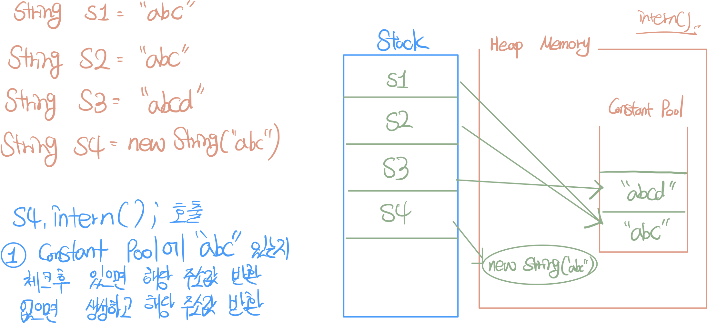

# 스터디 하면서 정리한 내용

진행: Done

## 리터럴 문자열과 new String의 차이

- 리터럴 문자열로 생성 시 자동으로 intern() 메소드가 호출된다.
- new String()은 자동으로 intern() 메소드를 호출하지 않는다.

### 🐯 intern() ?

> 해당 문자열이 상수 풀에 있는지 체크하고 있으면 주소값 반환 , 없으면 새로 만들고 주소값 반환
> → 메모리 절약

