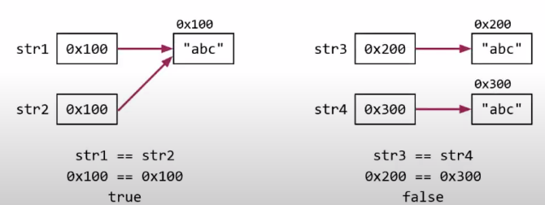

# 이재혁

진행: Done

# String클래스

- 문자열을 다루기 위한 클래스.
- String클래스 = 데이터(char[]) + 메서드(문자열 관련)

## 특징

- 내용을 변경할 수 없는 불변(**immutable**) 클래스
- 문자열 연산시 새로 객체를 만드는 Overhead 발생(성능이 떨어진다.)
- 문자열의 결합이나 변경이 잦다면, 내용을 변경가능한 StringBuffer, StringBuilder를 사용

## 문자열 비교

```
String str1 = "abc";
String str2 = "abc";
String str3 = new String("abc");
String str4 = new String("abc");
```



- str1 ,str2 는 문자열 abc를 가리킨다.
- str3, str4 는 각각의 인스턴스를 가리킨다.
- 문자열 리터럴로 문자열을 생성 시
  - **하나의 문자열을 여러 참조변수가 공유한다.**
- new 연산자를 사용 시
  - **항상 새로운 문자열이 만들어진다.**
- 문자열은 내용변경이 불가하기 때문에 여러 참조변수가 공유해도 문제가 생기지 않는다.
- 문자열 변수는 "==" 연산자로 비교 시 주소를 비교하기 때문에 값을 비교하기 위해선 equals함수를 써야한다.

## 문자열 리터럴

- 문자열 리터럴은 프로그램 실행시 자동으로 생성된다.(constant pool에 저장)
- constant pool
  - 프로그램에 있는 모든 상수를 저장하는 곳
- JVM은 문자열 상수 풀에 객체를 생성하고 해당 참조를 스택에 저장한다.
- JVM은 문자열 상수 풀에 리터럴의 복사본을 하나만 저장하여 문자열에 할당된 메모리 양을 최적화 할 수 있다.
  - interning 이라고함!
  - String변수를 만들고 값을 할당하면 JVM이 상수풀에서 동일한 String을 검색하고, 발견되면 메모리 주소값을 반환하고 그렇지 않으면 풀에 등록하고(interning) 해당 주소값을 반환한다.

## StringBuffer클래스, StringBuilder클래스

- 공통점
  - new 연산으로 클래스를 한 번만 만듬 (Mutable)
  - 문자열 연산시 새로 객체를 만들지 않고, 크기를 변경시킴
  - StringBuffer와 StringBuilder 클래스의 메서드가 동일함.
- 차이점
  - StringBuffer는 동기화되어 있다. 멀티 쓰레드에 안전함
  - StringBuilder는 동기화 되어 있지 않아서. 멀티 쓰레드에 안전하지 않음.
  - 멀티 쓰레드 프로그램이 아닌 경우, 동기화는 불필요한 성능저하를 일으킨다. 그럴때 StringBuilder를 쓰자.

# Object Class

> Java의 최상위 클래스

- 부모가 없는 클래스는 자동적으로 Object 클래스를 상속받게 된다.
- 모든 클래스는 Object클래스에 정의된 11개의 메서드를 상속받는다.
  - toString(), equals(Object obj), hashCode(),…

## toString()

- 객체의 문자 정보를 리턴한다.
  - 객체 문자 정보 : 객체를 문자열로 표현한 값
  - 기본적으로 Object 클래스의 toString() 메서드는 “클래스명@16진수해시코드” 로 구성된 문자 정보를 리턴
  - Object의 하위 클래스는 toString() 메서드를 오버라이딩 하여 간결하고 유익한 정보를 리턴하도록 되어 있다.
  - System.out.println() 메서드의 매개변수로 참조타입을 넘겨주면 객체의 toString() 메서드를 호출하여 리턴값을 받아서 출력하도록 되어 있다.

## equals(Object obj)

- 객체를 비교하여 참 거짓을 리턴한다.
  - 객체의 **주소**를 비교
- 객체의 인스턴스 변수의 값을 비교하고자 한다면 오버라이딩 해야한다.

## hashCode()

- 실행중에 객체의 유일한 integer값을 반환한다.
- Object클래스에서는 heap에 저장된 객체의 메모리 주소를 반환하도록 되어있다.
  ```java
  public native int hashCode();
  ```
- native란?
  - OS가 가지고 있는 메서드(C언어로 작성되어있는 경우가 많음)
  - JNI
    - OS가 가진 메서드를 java 메서드와 연결해준다.
      - java메서드를 호출할 시 , C나 C++로 작성된 함수가 실행됨
- OS가 가지고 있는 메서드가 객체의 주소를 int 값으로 반환해준다! 자바에서는 그걸 사용할 뿐!
- 그러므로 객체의 지문이라고함
  - 객체마다 다른 값을 가지기 때문
- equals()를 오버라이딩 하면, hashCode()도 오버라이딩 해야한다.
  - 두 함수의 공통점은 객체의 주소를 가지고 작업을 한다는 것이다.
  - equals는 보통 주소가 아니라 객체의 멤버변수를 가지고 작업하도록 오버라이딩 한다.
    - 그렇게 되면 hashCode()도 멤버변수를 가지고 작업하도록 오버라이딩 해야한다.
      - **equals() 결과가 true 이면 두 객체의 해시코드는 같아야한다.**

### 왜 그럴까?

> hash 값을 사용하는 Collection(HashSet, HashMap, HashTable)을 사용할 때 문제가 발생한다.

](./img/lee2.png)

[https://tecoble.techcourse.co.kr/post/2020-07-29-equals-and-hashCode/](https://tecoble.techcourse.co.kr/post/2020-07-29-equals-and-hashCode/)

hash값을 사용하는 Collection은 객체가 논리적으로 같은지 비교할 때 위의 과정을 거친다.

- hashCode 메서드의 리턴값이 우선 일치하고 equals 메서드의 리턴 값이 true여야 논리적으로 같은 객체라고 판단함.

### 그렇다면 무조건 같이 재정의 해줘야할까?

- hash 값을 사용하는 Collection을 사용하지 않는다면 equals와 hashCode를 같이 재정의 하지 않아도 된다라고 생각할 수 있지만
- 요구사항은 항상 변하고,협업환경에서 무조건(hashSet, HashMap, HashTable 사용안할거야!!!)이라는건 없다.
- 굳이 위험한 코드를 안고 가지말고 항상 같이 재정의 해줘야 한다고 생각한다.

# Casting

> 형변환
> 변수 또는 상수의 타입을 다른 타입으로 변환하는 것

## Primitive 타입

- **묵시적 형 변환**
  - 작은 데이터 타입에서 큰 데이터 타입으로 형 변환
  - 값에 대한 손실이 발생할 가능성이 없음
  - 따로 연산자가 필요없다.(JVM이 서비스 해줌)
- **명시적 형 변환**
  - 큰 데이터 타입에서 작은 데이터 타입으로 형 변환
  - 값에 대한 손실이 발생할 가능성이 있음
  - 명시적으로 형변환 연산자를 써줘야 한다.

byte → short → int → long → float → double

        char

## Reference 타입

- 사용할 수 있는 멤버의 갯수를 조절하는 것
  - 값이 달라지는 것이 아님
- 조상 , 자손 관계의 참조변수는 서로 형 변환 가능

### **업캐스팅(UpCasting)**

- 업캐스팅은 자식 클래스가 부모 클래스 타입으로 캐스팅 되는 것이다.
- 업캐스팅은 캐스팅 연산자 괄호를 생략할 수 있다
- 단, 부모 클래스로 캐스팅 된다는 것은 멤버의 갯수 감소를 의미한다.이는 곧 자식 클래스에서만 있는 속성과 메서드는 실행하지 못한다는 뜻이다.
- 업캐스팅을 하고 메소드를 실행할때, 만일 자식 클래스에서 오버라이딩한 메서드가 있을 경우, 부모 클래스의 메서드가 아닌 오버라이딩 된 메서드가 실행되게 된다.

### **다운 캐스팅(DownCasting)**

- 다운캐스팅은 거꾸로 부모 클래스가 자식 클래스 타입으로 캐스팅 되는 것이다.
- 다운캐스팅은 캐스팅 연산자 괄호를 생략할 수 없다
- 다운캐스팅의 목적은 업캐스팅한 객체를 다시 자식 클래스 타입의 객체로 되돌리는데 목적을 둔다. (복구)

### **instanceof 연산자**

- 참조 캐스팅을 잘못했다가 런타임 환경에서 에러가 나 프로그램이 종료 되버리면 서비스에 크나큰 차질이 생기게 된다.
- 따라서 코드 디버깅을 많이 하여 미리 예방하는 것이 베스트이지만, 이마저도 부족하면 직접 업캐스팅 / 다운캐스팅 유무를 확인하여 참조 캐스팅 동작을 결정하면 된다.
- 이때 사용되는 것이 instanceof 연산자인데, 이 연산자는 어느 객체 변수가 어느 클래스 타입인지 판별해 true/false를 반환해준다.

## 스레드 구현

> 자바에서 스레드 구현 방법은 2가지가 있다.

1. Runnable 인터페이스 구현
   1. Runnable 인터페이스를 구현한 경우는, 해당 클래스를 인스턴스화해서 Thread 생성자에 argument로 넘겨줘야 한다.
2. Thread 클래스 상속

- 둘다 run() 메소드를 오버라이딩 하는 방식이다.
- 자바는 단일 상속 만을 지원하기 때문에 Runnable 인터페이스를 구현하는 것이 많은 이점을 가져갈 수 있다.

## 스레드 실행

> 스레드의 실행은 run()이 아닌 start()호출로 해야한다.

- 분명 run() 메서드를 재정의 했지만 실제 스레드 작업을 시키려면 start()로 작업해야한다.
- run()으로 작업지시를 하면 스레드를 사용하는 것이 아니게 된다.
- Java에는 콜 스택이 있다. 이 영역이 실질적인 명령어를 담고 있는 메모리로 , 하나씩 꺼내서 실행시키는 역할을 한다.
  - 만약 동시에 두 가지 작업을 하기 위해선, 두 개 이상의 콜스택이 필요함
  - **스레드를 이용한다는 것은, JVM이 다수의 콜 스택을 번갈아가면 처리를 하는 것이고 사용자에겐 동시에 작업하는 것 처럼 보이게 된다.**
  - 즉 run() 메서드를 이용하는 것은 main()의 콜스택에 이용하게 되는 것이고
  - start() 메서드를 호출하면 JVM은 알아서 스레드를 위한 콜 스택을 새로 만들어 주고 새로운 콜스택에 run()을 호출하게 된다.

## 스레드의 I/O블락킹

- 입출력시 작업 중단되는 현상
- 싱글스레드의 경우 I/O을 기다리면서 아무일도 하지 않는다.
- 멀티스레드의 경우 I/O을 기다리는 것과 동시에 다른 일을 할 수 있다.

## 스레드의 우선순위

> 작업의 중요도에 따라 스레드의 우선순위를 다르게 하여 특정 스레드가 더 많은 작업시간을 갖게 할 수 있다.

- 자바에서는 1~10까지 부여할 수 있고 default를 5이다.
  - setPriority(int newPriority)함수를 통해 변경할 수 있다.
  - 실제로는 참고만 할 뿐 무조건 먼저 실행되지는 않는다.
    - OS 스케줄러가 담당
    - 확률을 높이는 것을 기대함

## 데몬 스레드

> 일반 스레드의 작업을 돕는 보조적인 역할을 수행

- 일반 스레드
- 데몬 스레드
  - 일반 스레드의 작업을 돕는 보조적인 역할을 수행
  - 일반 스레드가 모두 종료되면 자동으로 종료
  - GC, 자동저장, 화면 자동갱신 등에 사용된다.
  - 무한루프와 조건문을 이용해서 실행 후 대기하다가 특정 조건이 만족되면 작업을 수행하고 다시 대기하도록 작성한다.
  ```java
  void setDaemon(boolean on)
  //스레드를 데몬 스레드로 또는 사용자 스레드로 변경
  //매개변수 on을 true -> 데몬스레드가 된다.
  ```
  - setDaemon(boolean on)은 반드시 start()를 호출하기 전에 실행되어야 한다. 그렇지 않으면 IllegalTreadStateException이 발생.

## 스레드 그룹

> 서로 관련된 스레드를 그룹으로 묶어서 다루기 위한 것

- 모든 스레드는 반드시 하나의 스레드 그룹에 포함되어 있어야 한다.
- 지정하지 않고 생성하면 main스레드 그룹에 속한다.
- 자신을 생성한 스레드의 그룹과 우선순위를 상속받는다.

## 스레드의 상태

스레드의 상태는 5가지가 있다.

- NEW
  - 스레드가 생성되고 아직 start()가 호출되지 않은 상태
- RUNNABLE
  - 실행 중 또는 실행 가능 상태
- BLOCKED
  - 동기화 블럭에 의해 일시정지된 상태
- WAITING,
  TIME_WAITING - 실행가능하지 않은 일시정지 상태
- TERMINATED
  - 스레드 작업이 종료된 상태

## 스레드의 실행제어

> 스레드의 실행을 제어할 수 있는 메서드가 제공된다.

- **static sleep(long m)
  static sleep(long m, int n)** - 지정된 시간동안 스레드를 일시정지시킴. 지정된 시간이 지나면 자동으로 실행대기상태가 됨. - 특정 스레드를 지정해서 멈추게 하는 것은 불가능하다.
- **void join()
  void join(long m)
  void join(long m, int n)** - 지정된 시간동안 스레드가 실행되도록 한다. 지정된 시간이 지나거나 작업이 종료되면 join()을 호출한 스레드로 다시 돌아와 실행을 계속함.
- **void interrupt()**
  - sleep()이나 join()에 의해 일시정지상태인 스레드를 깨워 실행대기 상태로 만든다. 해당 스레드에서는 interrupted exception이 발생함으로써 일시정지 상태를 벗어나게 된다.
- **void stop()**
  - 스레드를 즉시 종료시킨다.
- **void suspend()**
  - 스레드를 일시정지시킨다. resume()을 호출하면 다시 실행대기상태가 된다.
- **void resume()**
  - suspend()에 의해 일시정지상태에 있는 스레드를 실행대기상태로 만든다.
- **static void yield()**
  - 실행중에 자신에게 주어진 실행시간을 다른 스레드에게 양보하고 자신은 실행대기상태가 된다.
  - yield, interrupt 메서드를 적절히 사용하면, 응답성과 효율을 높일 수 있다.
- **suspend(), resume(), stop()**
  - 이 메서드들은 dead-lock을 발생시키기 쉽기 때문에 사용을 지양하길 권장하고 있다.

## 스레드의 동기화(synchronization)

> 멀티 스레드 프로세스에서는 다른 스레드의 작업에 영향을 미칠 수 있다.

- 진행중인 작업이 다른 스레드에게 간섭받지 않게 하려면 ‘동기화’가 필요
  - 스레드의 동기화 - 한 스레드가 진행중인 작업을 다른 스레드가 간섭하지 못하게 막는 것.
- 동기화 하려면 간섭받지 않아야 하는 문장들을 ‘임계 영역’으로 설정
  - 임계영역은 lock을 얻은 단 하나의 스레드만 출입가능(객체 1개에 lock 1개)

### synchronized를 이용한 동기화

- synchronized로 임계영역(lock이 걸리는 영역)을 설정하는 방법 2가지
  1. 메서드 전체를 임계영역으로 지정
  ```java
  public synchronized void calSum(){
  //...
  }
  ```
  1. 특정한 영역을 임계 영역으로 지정
  ```java
  synchronized(객체의 참조변수){
  //...
  }
  ```
- 임계 영역은 많으면 많을수록 성능이 떨어지기 때문에 최소화 하는 것이 좋다.

## wait()와 notify()

> 동기화를 하면 효율이 떨어진다.
> 동기화의 효율을 높이기 위해 wait(), notify()를 사용.

- Object클래스에 정의되어 있으며, 동기화 블록 내에서만 사용할 수 있다.
  - wait()
    - 객체의 lock을 풀고 스레드를 해당 객체의 waiting pool에 넣는다.
  - notify()
    - waiting pool에서 대기중인 쓰레드 중의 하나를 깨운다.
  - notifyAll()
    - waiting pool에서 대기중인 모든 스레드를 깨운다.
